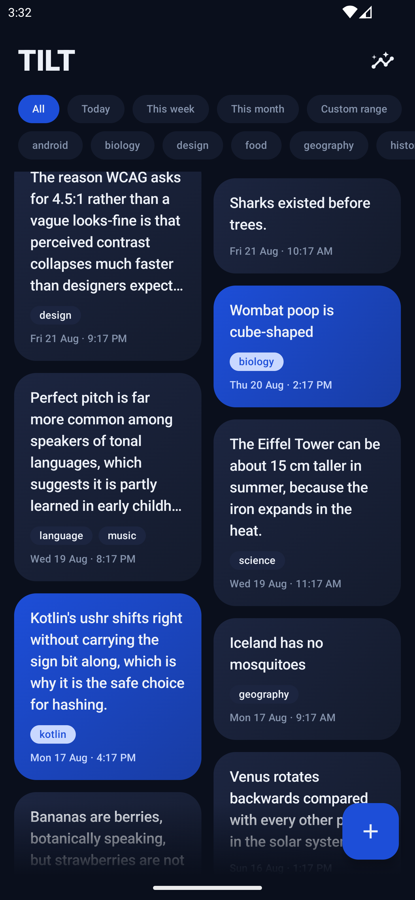
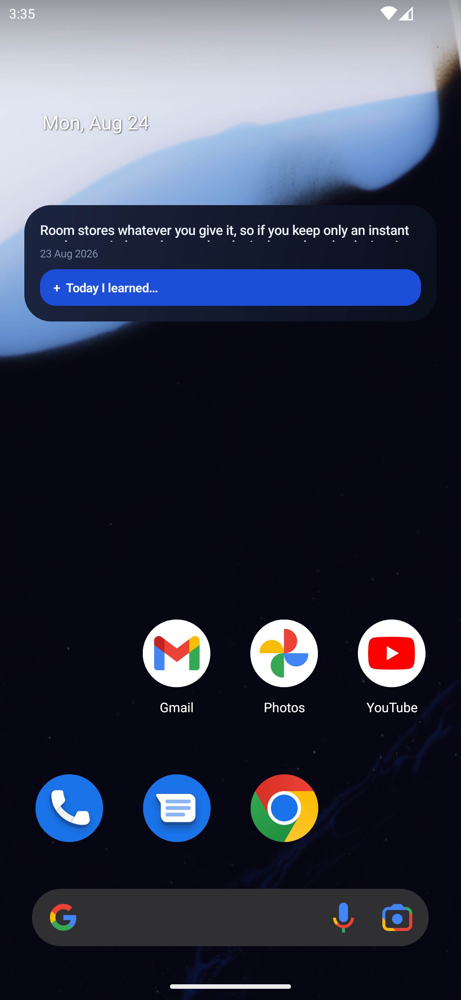

# TILT — Today I Learned Today

A minimal Android app for capturing and revisiting your daily learnings.

## What is TILT?

Small realizations are lost in the moment. Opening an app, navigating, filling a form — by then, the thought is gone. **TILT** removes that friction.

A single home-screen widget tap opens a quick-capture overlay floating over your home screen. Your entry is saved instantly. The same widget quietly rotates past entries back into view, so nothing you learned ever rots in a list nobody opens.

### Core Features

- **Instant capture** — One tap from widget to text field. No navigation, no forms.
- **Home-screen widget** — Quick-capture overlay and a rotating display of past entries.
- **Timeline** — Browse all entries as a staggered card grid, filterable by date range or label.
- **Stats** — Streak tracking (consecutive days with entries) and weekly/monthly volume.
- **Offline-first** — All data stored locally with Room. No cloud sync, no accounts.

## Screenshots

### Timeline



The timeline displays all captured entries in a responsive staggered grid. Filter by date range (All, Today, This week, This month, Custom) or by label. Cards show entry preview (6-line clamp), labels, date, and time. Blue accent cards draw the eye.

### Home-Screen Widget



The widget shows a rotating past entry at a glance, with the date at the top and a blue quick-capture button ("Today I learned..."). One tap opens the translucent capture overlay, no navigation needed. Sweeping gradient arcs frame the content.

## Visual Design

TILT follows a **dark navy aesthetic** with electric blue accents, inspired by minimalist financial & productivity apps. The design prioritizes instant access and playful discovery.

The visual direction:
- **Palette:** Near-black navy ground (`#0a0e27`) with vivid electric blue (`#00d9ff`) accents
- **Cards:** Staggered grid layout with entry previews, labels, and metadata at the card foot
- **Accent ratio:** Roughly one card in five filled with accent color for visual rhythm
- **Motion:** Sweeping gradient arcs, animated transitions, and smooth list interactions
- **Typography:** Heavy type hierarchy with prominent titles and supporting details

### Home-Screen Widget

The widget has two core jobs:

1. **Quick-capture tap target** — Opens a translucent overlay activity floating over your home screen. Type, add labels, save. Dismiss by tapping outside.
2. **Rotating entry display** — Shows a random past entry at a glance. Updates as entries change. When empty, prompts *"What did you learn today?"*.

The widget is **fully resizable** (Glance AppWidget) and stays fresh as you capture from either the widget or the in-app editor.

## Building

### Prerequisites

- Android Studio 2024.1+
- JDK 17+
- Android SDK API 30+

### Build & Run

```bash
./gradlew build
./gradlew installDebug           # Install to connected device
./gradlew connectedAndroidTest   # Run tests
```

### Troubleshooting

If `./gradlew` fails on rebuild, the project uses a redirected build directory. Re-run with a fresh output:

```bash
./gradlew clean build
```

## Project Structure

```
app/src/main/
├── java/com/mkdirchip/tilt/
│   ├── data/                    # Room entities, DAO, database, repository
│   ├── ui/
│   │   ├── capture/             # Quick-capture overlay & in-app editor
│   │   ├── timeline/            # Staggered card grid & filters
│   │   ├── stats/               # Streak & volume views
│   │   ├── theme/               # Navy palette & design system
│   │   └── Formatting.kt        # Shared text formatting
│   ├── widget/                  # Glance home-screen widget
│   └── MainActivity.kt
├── res/
│   ├── xml/tilt_widget_info.xml # Widget metadata
│   └── values/strings.xml, colors.xml, etc.
└── AndroidManifest.xml

openspec/
├── changes/add-til-capture-app/
│   ├── design.md                # Visual system overview
│   ├── proposal.md              # Feature spec & rationale
│   ├── tasks.md                 # Task breakdown
│   └── specs/
│       ├── til-entry/spec.md    # Capture & persistence
│       ├── til-timeline/spec.md # Browse & filter
│       ├── til-stats/spec.md    # Streak & counts
│       ├── til-widget/spec.md   # Home-screen widget
│       └── til-visual-system/spec.md # Design system
```

## Design System

**Palette:** Dark navy ground (`#0a0e27`) with electric blue accent (`#00d9ff`). Heavy type hierarchy, gradients, and animated transitions.

**Key Screens:**
- **Timeline:** Staggered card grid with entry previews, labels, and date/time.
- **Capture:** Translucent overlay activity with text and label fields.
- **Stats:** Calendar streak view, weekly and monthly counts.
- **Widget:** Rotating entry display and quick-capture tap target.

See `openspec/changes/add-til-capture-app/design.md` for the full visual spec.

## Storage

Entries are persisted locally using Room. Each entry stores:
- **Text:** Freeform entry content.
- **Labels:** Free-form, normalized (trimmed, case-insensitive).
- **Created:** Timestamp (captured automatically).
- **Last edited:** Timestamp.

## Key Concepts

### Streak
A streak is **consecutive calendar days** with at least one entry, evaluated in the device's local timezone.

### Label Normalization
Labels are normalized on save: trimmed, lowercased, deduplicated. Previously used labels are suggested during capture.

### Widget Freshness
The home-screen widget updates after entries are created, edited, or deleted from either the in-app editor or the quick-capture overlay.

## Dependencies

- **Room** — Local data persistence
- **Glance AppWidget** — Home-screen widget framework
- **Lifecycle ViewModel & Navigation Compose** — State & routing
- **Kotlin Serialization** — Data serialization
- `kotlinx-datetime` or `java.time` — Time handling

See `gradle/libs.versions.toml` for versions.

## Development Notes

- **Risk areas:** Widget-to-app data freshness and staggered-grid performance at scale.
- **Out of scope:** Cloud sync, full-text search, reminders, sharing/export.
- **No breaking changes:** Initial app version; backwards compatibility not yet a concern.

## License

Personal project.

## Specification & Design

Full feature specifications and design docs are in `openspec/changes/add-til-capture-app/`. Start with `proposal.md` for the project vision.
